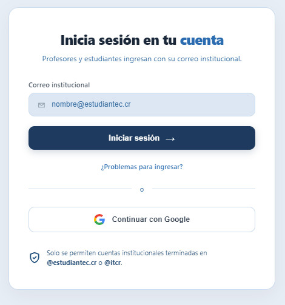
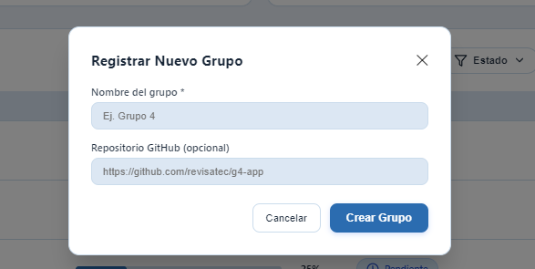
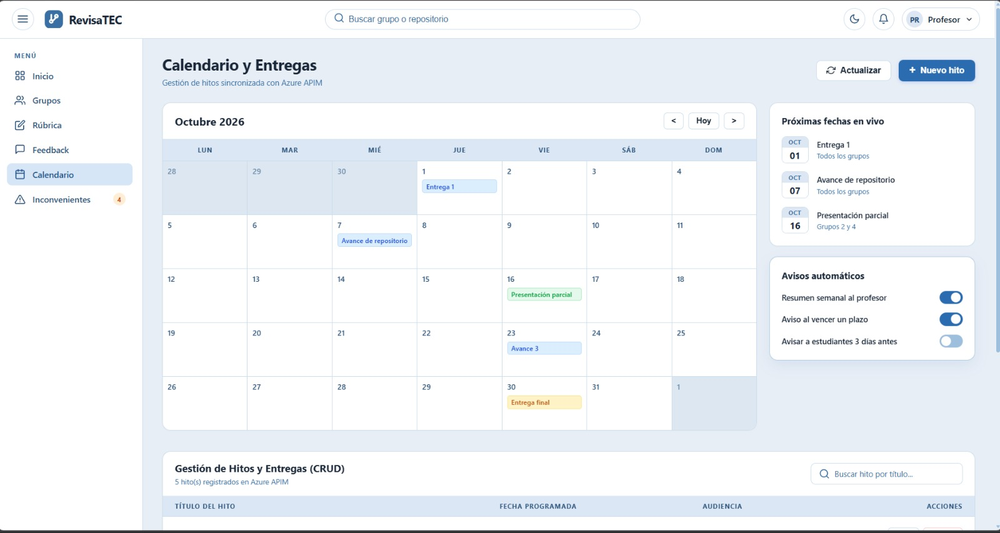
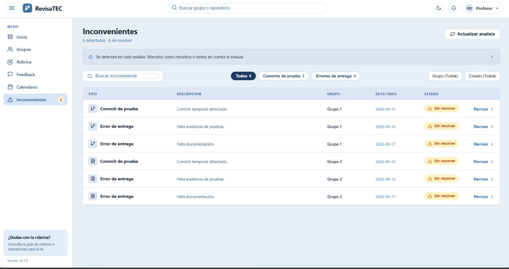
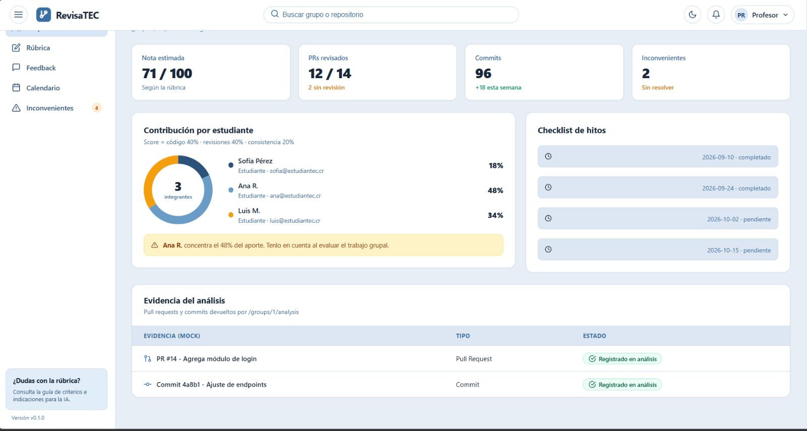
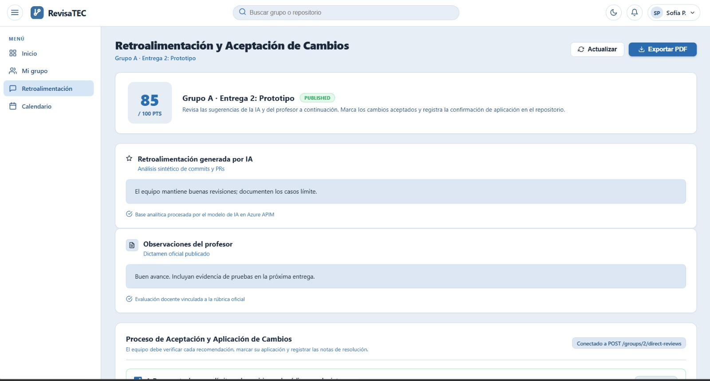
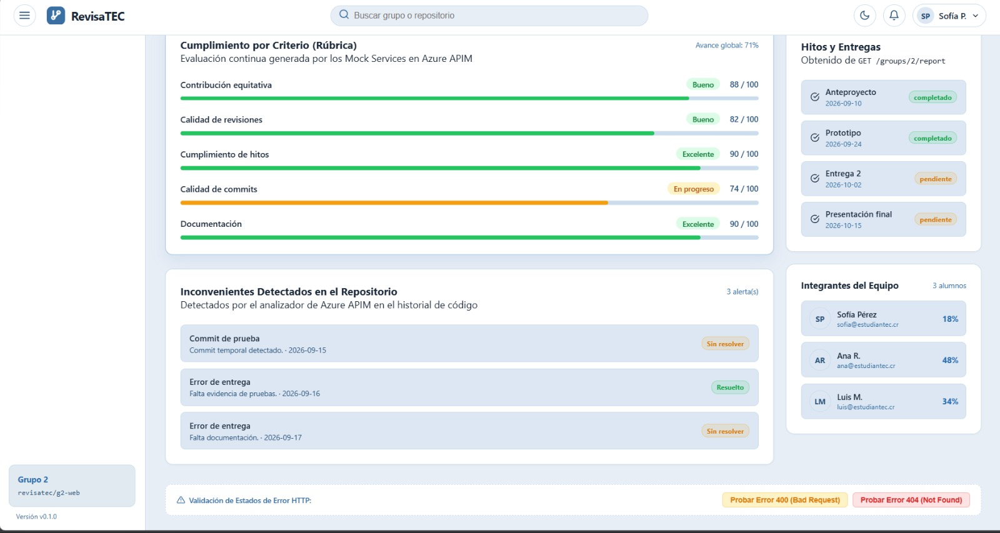
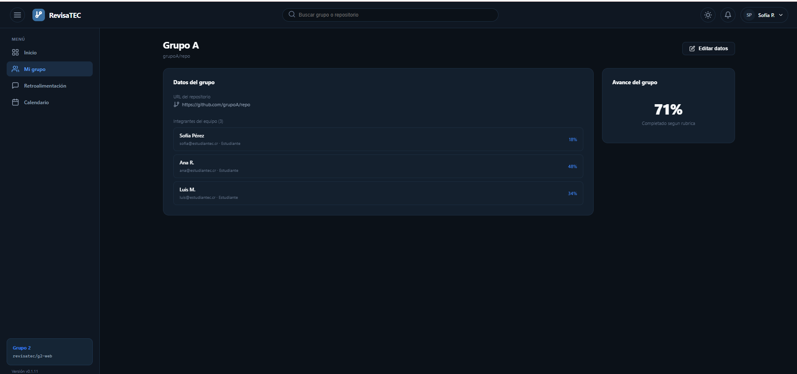
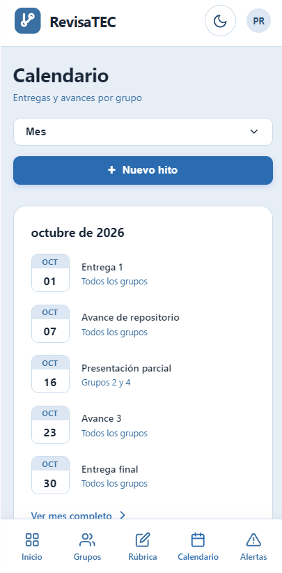

# RevisaTEC

Plataforma de revisión de código entre pares para proyectos grupales de cursos de programación del TEC.

**Aplicación desplegada:** https://green-ocean-067c41510.3.azurestaticapps.net

> **Estado:** Fase I (Proyecto Programado I). El frontend está desplegado y opera sobre **Mock Services** en Azure API Management; el backend real y la base de datos corresponden a la Fase II.

## Descripción

RevisaTEC se conecta al repositorio de GitHub/GitLab de cada equipo y exige que todo cambio pase por revisión de un compañero antes de fusionarse a la rama principal, replicando el flujo de trabajo estándar de la industria. Calcula un índice de contribución individual objetivo y se lo muestra al profesor en un dashboard.

## Problema que resuelve

Hoy el profesor solo ve el resultado final de un repositorio, sin visibilidad de si hubo control de calidad entre compañeros ni de cuánto aportó cada estudiante. Esto genera notas grupales injustas, deja pasar inconvenientes de último momento (commits de prueba, entregas fuera de plazo) y priva a los estudiantes de practicar el code review.

## Funcionalidades principales

- Inicio de sesión con correo institucional (solo cuentas terminadas en `@estudiantec.cr` o `@itcr`) o con Google (OAuth2), con redirección automática a la vista correspondiente según el rol del usuario.
- Configuración de rúbrica e indicaciones del curso con apoyo de IA (interpretación automática de PDF/DOCX/XLSX).
- Dashboard del profesor con métricas por grupo, próximas entregas e inconvenientes.
- CRUD completo de grupos (crear, listar, editar y eliminar) con búsqueda, paginación y confirmación antes de eliminar.
- CRUD completo del calendario de hitos, con búsqueda por título y paginación.
- Detalle de grupo con nota estimada, evidencia de PRs/commits y contribución por estudiante.
- Síntesis del avance por criterio de la rúbrica y retroalimentación (propuesta de la IA + versión editable del profesor).
- Calendario de entregas con avisos automáticos.
- Detección de inconvenientes (commits de prueba, errores de entrega).
- Panel del estudiante con su propio aporte, retroalimentación publicada (descargable en PDF), edición de datos del grupo (por ejemplo, la URL del repositorio) y calendario filtrado a su propio grupo.
- CRUD de revisiones y entregas directas en la vista del estudiante, con búsqueda en tiempo real, paginación y modales de edición y eliminación.
- Manejo de estados HTTP: mensajes de éxito (200 y 201) y botones de prueba para simular errores 400 y 404, con mensaje claro y acción de recuperación.
- Tema claro/oscuro persistente y diseño responsive (escritorio, tablet y móvil).

## Diseño y accesibilidad

El diseño se hizo en Figma: 12 pantallas de alta fidelidad, cada una en tres anchos y dos temas. Se aplicaron las heurísticas de usabilidad de Nielsen y los criterios de accesibilidad WCAG 2.1 AA (contraste mínimo 4.5:1 en ambos temas, navegación completa por teclado con foco visible y áreas táctiles de al menos 44 px en móvil).

## Arquitectura

Microservicios comunicados por cola de mensajes: **Repo-Integration**, **Review-Workflow**, **Contribution-Metrics**, **Reports**, **Notifications**, **Rubric-AI** y **Calendar**.

En la Fase I cada microservicio se representa con rutas simuladas (Mock Services) configuradas en Azure API Management, que actúa como gateway único tanto para el frontend como para las pruebas en Postman. Todavía no existe un backend desplegado en Azure App Service: ese componente queda reservado para la Fase II. Todos los datos de la interfaz se consumen de esas rutas a través de un cliente de API centralizado (`src/lib/apiClient.js`), sin datos escritos directamente en el código. El diagrama de arquitectura y los endpoints de los Mock Services están en `docs/`.

## Stack tecnológico

| Capa | Tecnología |
|---|---|
| Frontend | React 19 + Vite + React Router |
| Backend (Fase I) | Mock Services en Azure API Management (Consumption) |
| Hosting | Azure Static Web Apps (HTTPS) |
| CI/CD | GitHub Actions (lint, build y despliegue; versionado automático por git tag con GitHub CLI) |
| Autenticación | OAuth2 (Google) y correo institucional |
| Pruebas de API | Postman |
| Base de datos | Por definir en la Fase II (MongoDB Cosmos on Azure, Azure Queue Storage y Azure SQL como opciones previstas) |

## CI/CD y versionado

En cada push, el pipeline de GitHub Actions valida el código (lint y build) y, si pasa, despliega a Azure Static Web Apps. En cada despliegue se genera un tag de Git cuya versión se muestra en el pie de la aplicación. Las llaves de acceso (por ejemplo, la suscripción de Azure API Management) se gestionan solo como secretos de GitHub Actions y no se incluyen en el repositorio.

## Instalación y uso

```bash
git clone https://github.com/Crisaraya21/revisatec.git
cd revisatec
npm install
npm run dev
```

Variables de entorno (`.env.local`):

```
VITE_API_BASE_URL=<url del gateway de Azure API Management>
VITE_API_KEY=<llave de suscripción de Azure API Management>
VITE_GOOGLE_CLIENT_ID=<client ID de OAuth2 de Google>
```

Los valores reales se solicitan al equipo y no se suben al repositorio. En el despliegue se configuran como secretos de GitHub Actions.

## Equipo

- **Marlon Fabian Aragón Arce** — UX/UI: heurísticas, accesibilidad, wireframes, sistema de diseño, mockups de alta fidelidad e integración del login con Google.
- **Cristopher Daniel Araya Vega** — Infraestructura: repositorio, diagrama de arquitectura, Azure, Mock Services y pipeline CI/CD.
- **Leiner Josué Aguilar González (ZERO)** — Documentación formal, informe UX/UI y README.

## Capturas de pantalla

| | |
|---|---|
| **Login** (correo institucional o Google) | **Crear grupo** (modal) |
|  |  |
| **Calendario** | **Inconvenientes** |
|  |  |
| **Detalle de grupo** (contribución por estudiante) | **Retroalimentación** (IA + profesor) |
|  |  |
| **Panel del estudiante** | **Mi grupo — modo oscuro** |
|  |  |
| **Calendario — vista móvil (responsive)** | |
|  | |

> Capturas tomadas sobre el sistema desplegado. Cubren modo claro/oscuro y vista responsive (escritorio/móvil).

## Estructura del repositorio

```
revisatec/
├── .github/workflows/      # CI/CD: lint, build y despliegue a Azure Static Web Apps
├── docs/                   # Diagrama de arquitectura y endpoints de Mock Services
├── public/                 # Assets estáticos y staticwebapp.config.json
├── screenshots/            # Capturas usadas en este README
├── src/
│   ├── assets/             # Recursos gráficos
│   ├── components/         # Componentes reutilizables (Icons, formularios, banners)
│   ├── context/            # AuthContext, ThemeContext
│   ├── hooks/              # usePaginatedList
│   ├── lib/                # apiClient.js: cliente de la API (Mock Services)
│   ├── pages/              # Login, Groups, GroupDetail, Rubric, Calendar, Feedback,
│   │                       #   Issues, StudentDashboard, StudentFeedback, StudentGroup
│   ├── App.jsx             # Rutas y estructura principal
│   ├── main.jsx            # Punto de entrada
│   ├── theme.css           # Tokens de color (modo claro y oscuro)
│   └── index.css / App.css # Estilos globales
├── eslint.config.js        # Configuración de ESLint
├── index.html
├── package.json
├── vite.config.js
└── README.md
```

## Próximos pasos (Fase II)

- Reemplazar los Mock Services por microservicios reales en Azure App Service, detrás del mismo gateway de API Management.
- Persistencia con MongoDB Cosmos on Azure (eventos del repositorio) y Azure SQL Database (configuración y calificaciones).
- Mensajería asíncrona con Azure Queue Storage y avisos con Azure Notification Hubs.

## Créditos

- [React](https://react.dev/) — biblioteca de UI
- [Vite](https://vitejs.dev/) — bundler y entorno de desarrollo
- [React Router](https://reactrouter.com/) — enrutamiento
- [Azure Static Web Apps](https://azure.microsoft.com/products/app-service/static/) — hosting
- [Azure API Management](https://azure.microsoft.com/products/api-management/) — gateway y Mock Services
- [GitHub Actions](https://github.com/features/actions) — CI/CD
- [Postman](https://www.postman.com/) — pruebas de API
- [Figma](https://www.figma.com/) — diseño UI/UX
- [Draw.io](https://www.drawio.com/) — diagrama de arquitectura

## Licencia

Proyecto académico — Instituto Tecnológico de Costa Rica (TEC San Carlos), curso IC-6821 Diseño de Software, profesor Marcos Rodríguez, II semestre 2026.